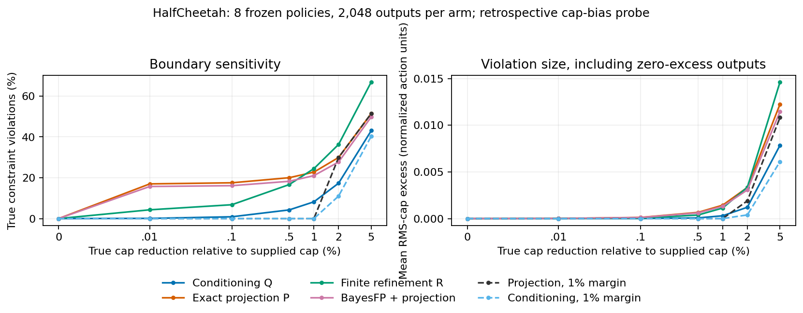

# Safety conditioning for diffusion policies

Does conditioning a frozen diffusion policy on safety preserve useful behavior better than projecting its samples? This simulation project compares exact rejection conditioning, exact full-horizon projection, finite projected-Langevin refinement, and a paper-derived BayesFP implementation.

**[Findings](RESULTS.md) · [What the methods compare](docs/METHODS.md) · [Reproduction](docs/REPRODUCTION.md) · [Paper integration](docs/PAPER_INTEGRATION.md)**

The evidence is mixed and retained in full:

| Question | Finding |
|---|---|
| Does the conditional target help? | Pendulum shows useful native-return gains of about 48–56 points over exact projection. Push-T is null; Walker2d slightly favors projection. |
| Does finite refinement beat BayesFP? | Across eight HalfCheetah models, refinement beats BayesFP plus identical projection by **16.88 [6.06,28.29]**, below the fixed 26.19-point useful-effect threshold. |
| Does it beat exact projection? | HalfCheetah refinement gains **17.12 [6.19,28.18]**; exact conditioning gains only **.98 [−2.70,4.88]**. |
| What if the supplied safe set is wrong? | With a .1% tighter true effort cap, violation rates are **.88% conditioning, 17.53% projection, 6.79% refinement**. At 1% error refinement loses this advantage. A valid 1% projection margin removes violations without detectable quality loss. |

Intervals in the HalfCheetah rows are crossed model/state 95% bootstrap intervals. These results do not show universal superiority, exact finite refinement, or improved online efficiency. Command-budget violations are not measured physical damage.



## Install and check

Recorded platform: Python 3.12, Linux x86_64, RTX 5070 Ti, PyTorch 2.7.1+cu128. All tasks use **one `.venv` and one dependency lock**. A C compiler is needed for the pinned Pymunk dependency. No driver installation is performed.

```bash
bash scripts/setup.sh
./run check
./run fetch-assets --task all
./run fetch-results
./run audit --input results/halfcheetah_replication
./run audit --input results/safe_set_mismatch
```

The check runs on CPU without downloaded weights. External RL/Push-T checkpoints are fetched from pinned public sources and checked by SHA256; they are not redistributed. The research release contains our generated data, diffusion checkpoints and raw experiment outputs, separate from Git. See [asset provenance](records/assets.json) and [third-party notices](THIRD_PARTY.md).

## Run experiments

```bash
./run reproduce pendulum --output results/new_pendulum
./run reproduce halfcheetah --output results/new_halfcheetah
./run reproduce walker2d --output results/new_walker2d
./run reproduce pusht --output results/new_pusht
./run study --output results/new_eight_model_study
./run mismatch --input results/halfcheetah_replication --output results/new_mismatch
./run report --input results/new_mismatch
```

Outputs must use fresh directories. Repeating recorded seeds checks reproducibility, not independent confirmation. Collection/training from scratch and exact configurations are in the [reproduction guide](docs/REPRODUCTION.md).

## Repository layout

```text
safety_conditioning/   Shared policy, samplers, constraints, simulation and analysis
  tasks/               Pendulum, Push-T and locomotion adapters/drivers
configs/               Fixed recipes and seeds
docs/protocols/        Scientific protocols, including the exploratory error grid
docs/paper_preview/    Combined experimental section and compiled PDF
results/              Task reports, summaries, figures and local raw outputs
records/              Provenance, hashes, migration map and audits
fixtures/             Small numerical references from the original implementations
scripts/              Setup, release packaging and repository verification
```

There is no separate experiment-round source tree. The `pre-consolidation` Git tag preserves earlier source/protocol bytes for historical locks. The active implementation uses shared DDPM sampling, refinement, BayesFP and projection code; archived scientific results are not rewritten to fit the cleanup.
