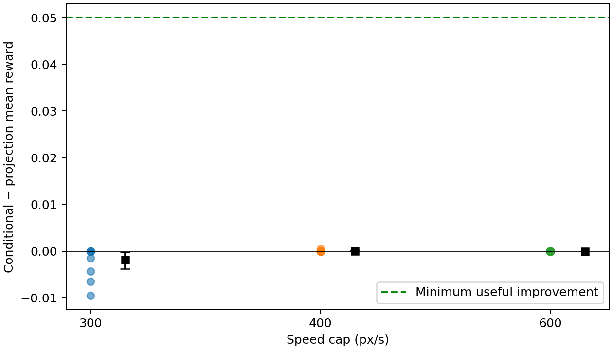
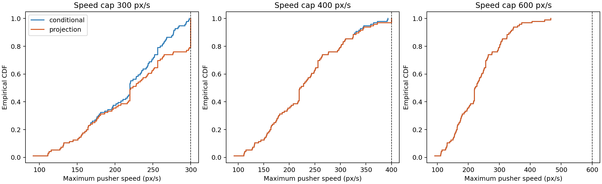
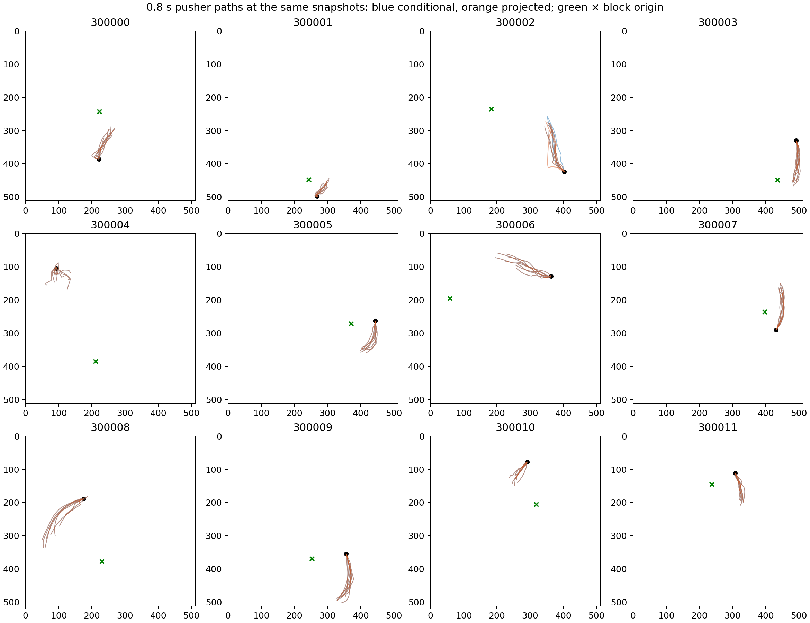

This is a historical documentation snapshot from the completed September 14 experiments. See [current results](../../RESULTS.md).

# Executed results

**New task/BayesFP extension:** [Round 3](../../round3/RESULTS.md) reports fresh Pendulum, Walker2d and HalfCheetah comparisons, with [draft integration and LaTeX tables](../../round3/PAPER_INTEGRATION.md). Pendulum remains the positive conditioning example. The new HalfCheetah refinement advantage over repaired BayesFP is a distinct finite-sampler finding; exact conditioning does not outperform projection there. The historical reports below retain their original numerical results.

**Latest recommendation: proceed with Pendulum.** The completed follow-up trained a state diffusion policy and confirmed two mirrored examples: exact conditioning gains **54.68 / 47.91 native return points** over full-horizon projection; finite annealed refinement gains **56.31 / 48.66**. All adjusted uncertainty intervals exclude zero, and all 3,072 outputs are feasible. Refinement still differs measurably from exact conditioning. See [ROUND2_RESULTS.md](../../ROUND2_RESULTS.md), [the frozen follow-up protocol](../../PENDULUM_CONFIRMATION.md), and [animated examples](../../results/pendulum/confirmation/examples.gif).

The original Push-T report below is retained, including its negative finding and the then-proposed next check. That contact check has now been executed; its outcomes and the task change are documented in the follow-up report.

## Original Push-T report

**The bounded pilot found projection boundary concentration, but no useful reward advantage for conditioning.** At the prespecified primary speed cap, only 3/96 projected chunks changed. The tighter secondary cap changed 20/96 chunks and slightly favored projection. All changed chunks were in free travel, without object contact. Useful alternative safe modes at shared states remain unverified.

Recommendation: perform the **shared-state contact-mode gate** described below before expanding this Push-T experiment. Do not start a large training campaign or a practical conditioned sampler based on this result.

## What actually ran

Everything ran on the requested workstation: AMD Threadripper 9980X, approximately 377 GiB RAM, NVIDIA RTX 5070 Ti (16,303 MiB), driver 595.84. The fresh environment is Python 3.12.3, PyTorch 2.7.1+cu128, Gym 0.26.2 and upstream-pinned Pymunk 6.2.1. PyTorch detected compute capability 12.0 and ran the released policy on CUDA. The initial sandbox could not access GPU devices/network; authorized host execution worked. Existing GPU processes continued, so wall times are measured under shared load.

Downloaded the public 143.7 MB state-based diffusion transformer checkpoint and the authors' source at the recorded Git revision. Loaded frozen EMA weights strictly and retained all 100 DDPM steps, saved normalization and original action-time slicing. No new policy, expert, safe-set estimator or safety-aware diffusion sampler was trained. Dataset download was unnecessary. Candidate RL checkpoints were checked by HTTP and inspected through metadata, not executed.

The original environment and policy source were untouched. The local driver ports dependency/runtime integration; it does not reproduce the entire old benchmark environment. A first smoke run used the initial dependency setup; the finalized smoke was rerun after pinning Pymunk 6.2.1 and gave the same aggregate outcomes. `results/smoke_initial_stack.json` is kept separate. The original dataset code's normalization is not training-mask-only; this study freezes the released normalizer and evaluates fresh simulator seeds rather than retraining it.

Executed checks:

- Eight unfiltered smoke episodes, seeds 100000–100007, at most 300 controls each. Mean maximum native reward **0.972398**; **2/8** strict completions. All six failures are recorded. Approximate exact binomial 95% completion interval is 3.2%–65.1%; this is a smoke test, not a precise policy benchmark.
- Six development snapshots, including fixed 1.6 s warmups for odd seeds, 64 independent proposals each. Earlier reset-only development exploration informed this fixed reset/moving mix before held-out execution.
- Six independent replay/dynamics/projection checks: identical replay traces, observed contact cases, maximum affine model error **8.95×10⁻¹³**, feasible full-horizon projections and projection idempotence.
- Locked held-out experiment: **12 snapshots × 8 replicates × 3 severities = 288 pairs**, producing **576 evaluated chunks**. Each replicate generated 64 proposals: **6,144 distinct base proposals total**, reused across severities. No held-out state, proposal or unsuccessful episode was excluded.
- Independent saved-data audit verified the protocol/code hashes, all membership masks, every first-feasible selection, output feasibility and common-continuation pairing. It found **265 identity pairs**, whose reward traces agree within 1e-12. `pip check` and the checkpoint plus 369-file vendor hash verification passed.

## Paired quality outcomes

The score is mean **native reward over 8.0 seconds**: execute the constrained chunk for 0.8 s, then continue with the same frozen policy for 7.2 s. The native reward is target coverage divided by 0.95, capped at 1. It is not IoU. The preregistered minimum useful conditioning gain was **+0.05**. Intervals resample the 12 snapshots as paired clusters, averaging the 8 replicates within each, with 10,000 bootstrap draws.

| Speed cap, pixels/s | Conditional mean reward | Projection mean reward | Difference, conditional − projection | 95% paired cluster interval | Projection changed |
|---|---:|---:|---:|---:|---:|
| 300, secondary | 0.124657 | 0.126476 | −0.001819 | [−0.003744, −0.000250] | 20/96 |
| **400, primary** | **0.120686** | **0.120645** | **+0.000041** | **[0.000000, 0.000123]** | **3/96** |
| 600, secondary | 0.126728 | 0.126728 | approximately 0 | numerical zero, ~1e-18 | 0/96 |

The primary interval excludes the chosen +0.05 threshold on these cases. Its narrowness largely reflects 93 identical pairs and only one snapshot with a non-negligible reward difference; it is not broad evidence that unseen states cannot benefit. The small projection advantage at 300 is far below the minimum useful effect and is a secondary result. No multiple-comparison claim is made. The 600 result is an inactive-constraint sanity check.

All **576** evaluations were unsuccessful at the native completion threshold within 8 s; completion time is right-censored at 8 s. Mean maximum native reward was 0.3182 versus 0.3242 at 300, 0.2944 versus 0.2946 at 400, and 0.3356 for both at 600. Thus the short evaluation shows some progress but is too early for reliable completion discrimination. The longer 30 s smoke demonstrates that the checkpoint can align the object; it does not establish successful short continuations from every chosen snapshot. Each severity uses a different batch row for continuation randomness; compare A versus B **within** a severity, not the cross-severity mean differences as a monotone causal curve.

## Reference acceptance and safety

| Cap | Accepted proposals / 6,144 | Range of per-snapshot acceptance | Logical rejection proposals for 96 outputs | Actual generated bank | Refusals | Projection failures | Unsafe chunk outputs A / B |
|---|---:|---:|---:|---:|---:|---:|---:|
| 300 | 5,022 / 6,144 (81.74%) | 18.36%–100% | 174 | 6,144 shared | 0 | 0 | 0/96 / 0/96 |
| 400 | 6,010 / 6,144 (97.82%) | 90.63%–100% | 99 | same bank | 0 | 0 | 0/96 / 0/96 |
| 600 | 6,144 / 6,144 (100%) | 100% | 96 | same bank | 0 | 0 | 0/96 / 0/96 |

Maximum first-accept proposal counts were 11, 2 and 1, respectively; budget was 64. The remaining generated proposals were retained for audit and support estimation. These are independent proposal draws, not reward-selected elites. Per-snapshot exact binomial intervals are in `results/heldout/per_state.json`; 512/512 acceptance has 95% interval approximately [0.9928,1], so empirical full acceptance does not prove Z=1. No zero-acceptance held-out case arose. Some earlier severe development caps did have zero acceptance; they were not silently interpreted as Z=0.

The full-horizon convex projection uses all 80 physics substeps, the same bounds and initial state, and a strictly convex squared Euclidean action distance. All nonidentity solves returned `optimal` and passed the independent simulator check. The maximum held-out analytic-versus-simulator trajectory error was **1.30×10⁻¹²**. Feasibility tolerance was 1e-5. Reported zero unsafe outputs refers only to the constrained **initial chunk**.

The unfiltered continuation later exceeded the same cap in 45/96 conditional versus 42/96 projected episodes at 300; 9/96 versus 9/96 at 400; and 1/96 versus 1/96 at 600. These are recorded, not claimed safe episodes. The pilot isolates the initial chunk and does not implement whole-episode safety filtering. No missing/unsafe outputs arose, so operational scores and target-output scores coincide here; the analysis code has separate missing-output accounting and [0,1] bounds for failed references.

## Distribution shape and behavior

| Cap | Conditional outputs within 1 pixel/s of boundary | Projected outputs within 1 pixel/s of boundary |
|---|---:|---:|
| 300 | 0/96 | 20/96 |
| 400 | 0/96 | 3/96 |
| 600 | 0/96 | 0/96 |

The boundary mechanism is directly visible, especially at 300. It did **not** produce a consequential behavior-quality penalty in this design. Every changed projected chunk had zero contact controls and zero block displacement over its 0.8 s execution. Corresponding immediate chunk mean rewards were identical across methods. The constraint mostly altered free-travel timing; the common controller then continued the approach. This is a plausible explanation of the small effects, inferred from the recorded trajectories rather than assumed in advance.

At every severity, both methods had identical descriptive endpoint route counts: **35 left, 2 center, 59 right**. Chunk rotation counts were **17 negative, 78 neutral, 1 positive**. The labels use the same initial pusher-to-block direction and fixed thresholds within each snapshot. They are geometric diagnostics, not learned or confirmed behavioral modes.

Among the eight selected outputs per snapshot, 11/12 snapshots occupied a single route bin. The one three-bin snapshot (300004) had no object contact in any sampled chunk; mean subsequent rewards by left/center/right bin were approximately 0.123/0.108/0.054, with no completions. This does not establish several coherent useful alternatives. In the entire proposal bank, at primary severity 8/12 snapshots had all 512 proposals in one bin; other states had tails crossing bin thresholds. A bin boundary is not a density valley or a separate strategy. Four snapshots had contact in all eight selected chunks, but those chunks were already feasible and were not changed by projection.

The path figure shows all selected trajectories at all snapshots, without choosing favorable examples. Paths generally form a narrow approach family. It does not verify the desired combination of active safety restriction, several useful surviving modes and harmful projection concentration. No claim of demonstrated conditional multimodality is warranted.

## Cost, records and remaining work

Held-out execution took **251.82 s** total. Generating the entire 6,144-proposal bank took **70.86 s** across snapshots; it was reused for all severities. The implementation deliberately overgenerates fixed GPU batches and records that cost. Total projection calls took about **0.060 s** across 288 requests, including identity cases, excluding base-policy sampling. These figures are not an equal-compute online comparison. Rejection was practical as an offline reference here; no approximate conditional sampler was needed.

Raw actions, all proposals (including rejected/unused), 81-point speed traces, RNG seeds, masks, snapshots and prefixes, solver status, executable outputs, every reward trace and actual substep states are saved. Start with `results/heldout/summary.json`, `per_state.json`, `modes.json`, `proposal_route_diagnostics.json`, `audit.json` and `protocol_lock.json`. Asset URLs/revisions/licenses/hashes are in `records/asset_manifest.json` and the source manifests. The exact lock file and runnable commands are in [README.md](../../README.md). The protocol hash still matches the file written before held-out evaluation.

**Specifically named next check: shared-state contact-mode gate.** Before another held-out comparison, use a new development-only seed range (400000–400015), take snapshots at fixed times 3.2, 4.8 and 6.4 s under the unmodified controller, and draw 64 independent chunks per snapshot. Examine complete pusher/contact trajectories from each identical state under a development speed-cap grid of 150, 250 and 350 pixels/s, counting initially infeasible states. Select trajectories for continuation in fixed proposal order, without reward ranking; evaluate them to the normal 30 s episode limit. The gate requires at least two separated approach/contact families with ≥10% empirical occupancy each at the **same** snapshot, both with median maximum native reward ≥0.8, and a cap with acceptance between 0.1 and 0.9 that still leaves both useful families. Trajectory clustering/visual review must distinguish coherent families from threshold-crossing noise. These thresholds and seed ranges are a proposed new development check, **not executed results** and not a retuning of this held-out run.

If that gate fails, reject this Push-T checkpoint/constraint design for the proposed multimodal mechanism and move to the reflected-TD3 Pendulum feasibility gate in [TASK_SELECTION.md](../../TASK_SELECTION.md). The present pilot already argues against a useful conditioning gain for its frozen speed-limit design. It does not justify rejecting conditioning in general, nor does projection boundary mass alone justify pursuing a new sampler.
