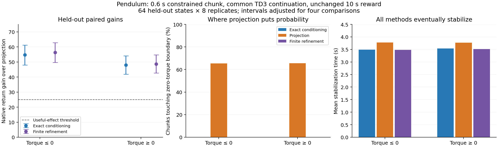

# Confirmed useful examples: Pendulum diffusion policy

**Recommendation: proceed with Pendulum as the primary controlled example.** A learned state diffusion policy supports two coherent swing directions from the same downward states. Under either of two temporary one-sided torque envelopes, exact conditioning and a finite implementation of the draft's annealed Langevin refinement outperform exact full-horizon Euclidean projection. This is a result on two mirrored constraints in one task, not two independent benchmarks or a universal guarantee.

All work ran in simulation on the inspected Threadripper 9980X / RTX 5070 Ti workstation. The existing Python 3.12.3, PyTorch 2.7.1+cu128 environment was reused; no other GPU jobs were stopped. No outreach or publication occurred.

## Held-out result

The protocol, code, checkpoint and seeds were frozen in [PENDULUM_CONFIRMATION.md](../../docs/protocols/pendulum_confirmation.md) and [the execution lock](confirmation/lock.json). Each example uses 64 new near-downward states × 8 paired replicates = 512 outputs per arm. A chunk lasts 12 controls × 0.05 s = **0.6 s**; the same public deterministic TD3 controller then continues every arm to **10 s**. Reward is the unchanged native Pendulum angle/velocity/effort reward, summed over all 200 controls.

| Initial 0.6 s envelope | Projection return | Exact conditioning return | Conditioning gain [adjusted interval] | Finite refinement return | Refinement gain [adjusted interval] |
|---|---:|---:|---:|---:|---:|
| Torque in [-2,0] Nm | -422.76 | -368.09 | **+54.68 [47.97, 61.23]** | -366.46 | **+56.31 [49.71, 62.83]** |
| Torque in [0,2] Nm | -426.56 | -378.65 | **+47.91 [41.84, 54.06]** | -377.91 | **+48.66 [42.71, 54.71]** |

Higher return is better. Intervals are paired state-cluster bootstrap intervals from 20,000 resamples, individually 98.75% to adjust for four comparisons. They address fresh-state and sampling variation within the chosen setting, not uncertainty from selecting the task. All four gains exceed the **prespecified 25-point minimum useful effect**, with intervals excluding zero.

All **3,072 outputs** were feasible over their entire constrained chunk. There were **zero rejection refusals**, **zero solver failures**, and **zero unsafe outputs**. Projection is closed form, not an iterative numerical solver: clip every coordinate into the same 12-dimensional box. This is its unique global Euclidean minimizer. The audit checks both exact equality to clipping and the projection variational inequality against all feasible proposals.

All 3,072 episodes stabilized within 10 s under the fixed secondary definition (upright angle within 0.1 rad and speed within 0.5 rad/s for 1 s). Thus the gain concerns progress and completion time, not a manufactured difference in failure rates. Mean stabilization times were 3.494 / 3.781 / 3.482 s for conditioning / projection / refinement under negative torque, and 3.537 / 3.770 / 3.513 s under positive torque. Pendulum itself has no native success termination; every native episode still runs its 200 controls.

A separately labeled **post-confirmation sensitivity check** reexecuted the same frozen chunks using the reflected TD3 controller as the common continuation. Conditioning gains remained +49.02 / +54.11, and refinement gains +50.74 / +54.82. This reduces concern that the result depends on choosing one particular continuation direction. It is not an additional independent confirmation sample; see `results/pendulum/reflected_continuation`.

[Animated examples](confirmation/examples.gif), [static examples during the restriction](confirmation/examples_at_0.55s.png), [PDF figure](confirmation/comparison.pdf), [SVG figure](confirmation/comparison.svg). Illustrations use the first proposal whose mean torque lies in the excluded coherent direction, without looking at its reward. All other trajectories remain in the raw records.

## Why this example works

In **every held-out state**, the unfiltered proposal bank contains both useful directions: negative-mode occupancy ranges 29.3–55.1% across states; positive-mode occupancy ranges 31.1–58.8%. These are coherent action sequences from a learned diffusion policy trained on complete controller episodes, not independent Gaussian action noise around an expert. Unfiltered first chunks followed by the common controller yield mean return -367.39 and all 512 episodes stabilize.

The constraint removes an entire useful torque direction during the initial swing. Rejection retains complete feasible chunks in the remaining direction. Projection clips the excluded direction toward zero torque, reducing the initial swing and delaying recovery. Negative/positive conditioning outputs occupy the retained coherent mode in 98.8%/99.2% of cases; projection does so in 46.9%/47.1%. Refined outputs occupy it in 100% of both examples.

The added zero-torque boundary is touched by **65.4% / 65.6%** of projected chunks, versus **0%** for conditioning and refinement. Mean absolute angle displacement over the first 0.6 s is roughly 0.67–0.68 rad for conditioning/refinement, versus 0.34–0.35 rad for projection. This links distributional deformation to a continuous native task cost.

The torque envelope is an externally supplied, temporary actuator-admissibility constraint. It is deliberately simple and does not claim to be a built-in Pendulum hazard, a state-safety certificate, or a full-episode restriction. Its simple geometry makes projection especially strong: exact global projection over the complete horizon with no approximation disadvantage. Both arms receive the same information and continuation. This experiment retains one principal safe direction; it does **not** yet demonstrate preservation of relative weights among several disconnected surviving safe modes.

## What the implemented refinement establishes

The supplied [repository](https://github.com/CadenzaCoda/safe-diffusion-mujoco), inspected at `e2b2546d948c04f63ae7232933c768956872a94f`, contains public RL expert acquisition/evaluation code, not the draft's refinement sampler. [src/pendulum_refine.py](https://github.com/jpothen8/safe-diffusion-conditioning/blob/pre-consolidation/src/pendulum_refine.py) is a new, explicitly specified implementation of that draft's projected Langevin mechanism, with gamma=1/2.

It starts from the terminal projection, uses the frozen learned score through an explicit VP-to-VE conversion, and refines at DDPM levels 20, 5, 0 for 256, 256, 512 steps. Step size is `.15*sigma^2/(1+k/64)^.6` within each level. Projection at every iteration keeps the full chunk feasible. Three schedules were tried in development; this one was fixed before confirmation. The model, reward and sampling schedule were not retuned on held-out results.

**Refinement wins on behavior but does not yet reproduce exact conditioning.** Action-kernel MMD to the rejection reference is 0.251 / 0.237 for refinement, versus 0.621 / 0.669 for projection. Independent rejection-versus-rejection comparisons give 0.029 / 0.038. The remaining discrepancy is substantially above that sampling-noise scale. Physical saturation frequency also differs: conditioning often retains exact +/-2 Nm atoms introduced by the original sampler, while refinement puts less mass there. Good reward is insufficient evidence of the correct conditional law.

These findings support pursuing the target and show that a finite version of the proposed mechanism can recover useful behavior here. They do not validate the draft's unproved convergence claims, asymptotic rates, general relaxation strengths, nonconvex extensions, or a general equality between a learned score's law and the distribution produced by a finite DDPM sampler. See [PAPER_ALIGNMENT.md](../../PAPER_ALIGNMENT.md).

## Assets, policy quality and reproduction

The public [SB3 TD3 Pendulum checkpoint](https://huggingface.co/sb3/td3-Pendulum-v1) was downloaded at revision `f200e871a887a68eec2265f1c6ff366cfbf40ea8`, SHA256 `9597e5a20703d74786afc8e5f48d98b378816ad8743ee62e2a278483bc565823`. Its saved actor has 3 observations, 400/300 ReLU hidden units, tanh output scaled to [-2,2], and no observation normalization. The extracted actor was run in **untouched Gym 0.26.2 Pendulum-v1**, achieving mean return -134.35 over seeds 0–9. This is a local smoke result on different seeds from the release's reported score, not a reproduction claim for its exact benchmark. Dynamics/reward definitions were checked against [official documentation](https://gymnasium.farama.org/environments/classic_control/pendulum/) and installed official source.

The reflected controller is `pi_ref(c,s,w) = -pi(c,-s,-w)`. Forty shared-state expert probes established distinct coherent initial swing directions and useful completed trajectories. The first attempted 16-control / 0.8 s all-negative constraint had **zero accepted expert chunks**, because the swing controllers reverse torque before that horizon ends. It was discarded in development; no conditional distribution result was claimed for it. The 12-control / 0.6 s horizon retains useful support. This change preceded diffusion-policy confirmation.

Collected **640 complete episodes** from 320 paired initial-state groups. Both reflected episodes of a group stay in the same 80/10/10 split. Only after splitting were 12-action overlapping chunks constructed; normalization uses training episodes only. Training uses 96,768 chunks, a 146,956-parameter state denoiser, 12,000 updates with batch 512 and an EMA. The frozen checkpoint is `assets/pendulum_diffusion.pt`, SHA256 `ad34c0f1f53bb66cdc9379b5033b06a466cfeb97742a0d6100714ccbf0b35e99`.

Before filtering, held-out demonstration-group resets were used to validate closed-loop imitation. With 4-control / 0.2 s execution intervals, mean native return was -331.58 across 32 states. Executing every 12-control chunk in a fully closed loop was weaker (-555.75); that limitation is retained. The decisive experiment instead isolates one 12-control chunk followed by the same expert continuation, exactly as specified. The successful first-chunk/common-continuation baseline supports that bounded comparison, not a claim of a robust general-purpose diffusion controller.

The recorded collection and training were rerun in an isolated directory and reproduced **both the entire demonstration archive and the checkpoint SHA256 exactly**. [scripts/train_pendulum_recorded.py](https://github.com/jpothen8/safe-diffusion-conditioning/blob/pre-consolidation/scripts/train_pendulum_recorded.py) explicitly uses the preserved collection arithmetic. No existing checkpoint or local demonstration dataset was assumed at the outset. Source URLs, revisions, licenses/unknown license status and hashes are in [records/followup_assets.json](../../records/followup_assets.json); dependencies remain in `requirements.lock.txt`.

The safe replication command in [README.md](../../README.md) was also run end to end in a new project-output directory. It reproduced all 32,768 proposals and all 3,072 full action traces exactly, including the continuation. Dependency checks report no broken requirements. These are executed checks, not commands merely prepared for the target host.

## Reference cost and independent checks

The reference generated **32,768 full diffusion proposals**, shared across the two constraints. Acceptance was **34.03% / 34.09%**, requiring mean logical counts **3.109 / 3.041** proposals per output. The actual fixed batches generated all 64 proposals per replicate, including unused proposals; that entire cost is counted. No rewards were used to pick accepted chunks. The same proposal-zero sample was projected for the paired baseline.

On the shared workstation, the corrected confirmation took **14.16 s**. Proposal-bank generation took **9.68 s**. Refinement added **1.44 / 1.41 s** for 512 outputs per sign, or 1,024 score evaluations/output in addition to the base sample. Closed-form projection took approximately 18 / 24 microseconds for the vectorized 512-chunk arrays, excluding base sampling. These are measured batch costs, not online single-action latency or an equal-compute benchmark. Rejection's logical expected score cost is about 310 evaluations/output here, lower than this refinement schedule; the practical efficiency problem remains open.

All proposals, accept masks, first indices, independent second accepted samples, output chunks, complete simulator states/actions/rewards, costs, failures and bootstrap summaries are retained. [The independent audit](confirmation/audit.json) verifies first-feasible selection, exact projection, output bounds, protocol/model hashes and shared-state occupancy.

The initial confirmation's long stored-action Gym replay exposed float32-versus-float64 torque arithmetic in the vectorized simulator. All outputs were feasible, but the replay check failed. We preserved that run in `confirmation_initial_precision`, corrected array torque promotion to match Gym's scalar arithmetic, and reran the identical frozen experiment. **Every proposal and output chunk remained bitwise identical**. Return changes were numerically negligible, and corrected replay agrees within 4.4e-19. The failed check, diagnosis and protocol amendment are preserved; it was not silently treated as a passed run.

## Search history and negative findings retained

The [original Push-T pilot](../../RESULTS.md) remains unchanged in its scientific conclusion: its primary speed cap showed no useful gain, and its tighter cap slightly favored projection. Boundary concentration alone was insufficient.

The follow-up completed the contact probe at **48 snapshots** from seeds 400000–400015 at 3.2, 4.8 and 6.4 s. It drew 64 chunks/snapshot and continued the first 16 in fixed order toward the ordinary 30 s episode limit; this took 1,380.91 s. These were development cases, and the investigation did not establish the desired combination of distinct useful surviving modes and a large projection penalty.

A workspace-curtain/speed development grid checked **1,680 settings**, of which 232 had the specified acceptance range and were simulated after projection: 3,712 projections, zero solver failures. The best immediate mean-score screen gain was +0.0270. Such selected development estimates are not held-out evidence.

One contact setting was independently resampled with 32 pairs, budget 64 and a 16 s evaluation: conditioning mean coverage 0.8570 versus projection 0.8377, gain **+0.0193**, bootstrap 95% interval [0.0013,0.0386]. Both completed 11/32 episodes. This was positive but below the previously fixed 0.05 useful-effect threshold. Its records remain in `results/development_contact_001`.

A separate development screen used **3.2 s** macro chunks, defined by four successive frozen diffusion calls on private simulator forecasts. This explicitly changes p's sampling procedure; it is not mislabeled as the original 0.8 s chunk distribution. Seven available snapshots were evaluated, with 315 settings, 48 projected-outcome screens and zero solver failures. Best immediate gain was +0.0465. Nine later snapshots were not run in this longer-horizon extension; no complete 16-snapshot claim is made. We bounded that extension after finding the cleaner Pendulum mechanism.

Pendulum development also retained weaker constraints: allowing up to +1 Nm in the negative envelope gave +23.99 points, while allowing down to -1 Nm in the positive envelope gave only +1.24. These were not promoted into useful held-out examples. All three finite refinement schedules, the unsuccessful 0.8 s expert-support test, and the weaker 12-step closed-loop imitation baseline remain saved.

The current next scientific step is to reduce and measure the refinement-to-rejection distribution gap on this fixed task, then add a harder externally supplied state constraint or more than one surviving safe mode. **Proceed with Pendulum for the motivating example; keep Push-T as a contact-rich extension, with its negative results visible.**
